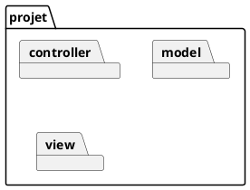
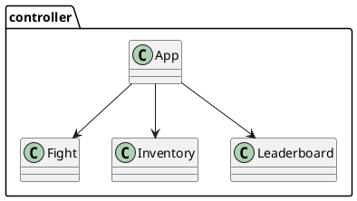
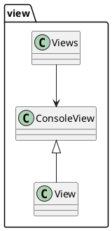
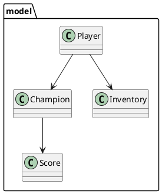
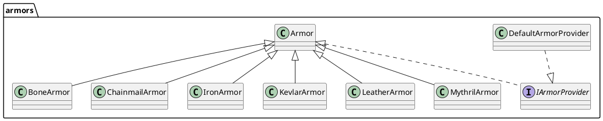
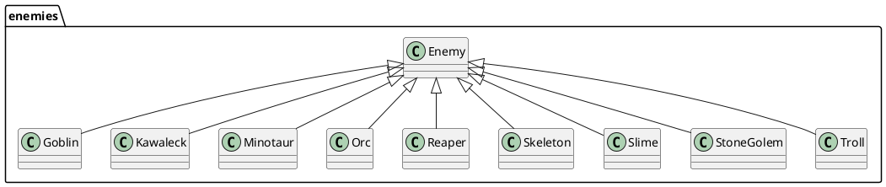
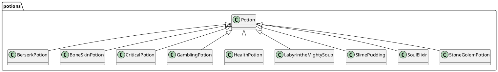
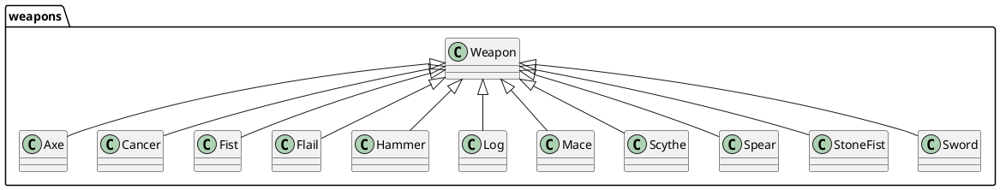

# Projet Fil Rouge - Jeu Java

## Table des matières

## Table des matières

- [Projet Fil Rouge - Jeu Java](#projet-fil-rouge---jeu-java)
  - [Table des matières](#table-des-matières)
  - [Table des matières](#table-des-matières-1)
  - [Information sur le groupe](#information-sur-le-groupe)
  - [Description](#description)
  - [Architecture et Conception](#architecture-et-conception)
  - [Fonctionnalités](#fonctionnalités)
  - [Prérequis](#prérequis)
  - [Lancement du jeu](#lancement-du-jeu)
  - [Tests](#tests)
  - [Structure du projet](#structure-du-projet)
  - [Diagramme UML](#diagramme-uml)
    - [Diagramme d'Architecture Générale](#diagramme-darchitecture-générale)
    - [Diagramme du Controller](#diagramme-du-controller)
    - [Diagramme de la Vue](#diagramme-de-la-vue)
    - [Diagramme du Modèle](#diagramme-du-modèle)
    - [Diagramme des Armors](#diagramme-des-armors)
    - [Diagramme des Enemies](#diagramme-des-enemies)
    - [Diagramme des Potions](#diagramme-des-potions)
    - [Diagramme des Weapons](#diagramme-des-weapons)
  - [Design Patterns](#design-patterns)
  - [Logique de travail](#logique-de-travail)
  - [Améliorations prévues](#améliorations-prévues)
  - [Transparence IA](#transparence-ia)
    - [Usage et Critique](#usage-et-critique)
    - [Conclusion](#conclusion)


## Information sur le groupe

> **Auteurs :**
>
>  - VIGNE Nathaël
>  - LUCIEN-REINETTE Quentin
>  - BEN HAMOU Ilian
>
> **Date :** 15/12/2025

---

## Description

Jeu d'aventure-console développé en Java. Le joueur incarne un Champion qui peut équiper des armes et armures, gérer un inventaire, affronter des ennemis et gagner de l'expérience. Le coeur du gameplay repose sur les classes : `Champion`, `Player`, `Weapon`, `Armor`, `Inventory` et `Fight`.

Le projet est conçu pour la programmation orientée objet avancée (POOA) : modularité, gestion d'inventaire, niveaux et progression d'armes.

---

## Architecture et Conception

- Langage : Java (Gradle)
- Build : Gradle (wrapper fourni)
- Entrées : console (Scanner)

Principales responsabilités :
- `Champion` : structure de base pour tout combattant (vie, moveSpeed, armes, armures)
- `Player` : extension de `Champion` avec inventaire et gestion de niveau
- `Weapon` / `Armor` : objets équipables avec expérience et niveaux
- `Inventory` : stockage des armes, armures et potions
- `Fight` : logique de combat entre champions

Design notes : le code favorise la séparation des responsabilités et la testabilité unitaire.

---

## Fonctionnalités

- Gestion d'un inventaire (armes, armures, potions)
- Échange (swap) d'équipement entre personnage et inventaire
- Combat entre le joueur et des ennemis avec logique de vitesse et d'attaques
- Progression d'armes (XP / niveau)

---

## Prérequis

- JDK 21 ou supérieur
- Git (optionnel)

---

## Lancement du jeu

Pour lancer le projet
```
.\gradlew.bat build
cd app
java -cp build\classes\java\main projet.controller.App
```

---

## Tests

Les tests unitaires se trouvent sous `src/test/java`. Lancez :

.\gradlew.bat test

Les rapports sont générés dans `build/reports/tests/`.

---

## Structure du projet

```
src
├── main
│   └── java
│       └── projet
│           └── controller/
│               ├── App.java
│               ├── Champion.java
│               ├── Player.java
│               ├── Fight.java
│           ├── Inventory.java
│           ├── weapon/
│           ├── armor/
│           └── enemies/
└── test
│   └── PlayerTest.java
```

---

## Diagramme UML

### Diagramme d'Architecture Générale



### Diagramme du Controller



### Diagramme de la Vue



### Diagramme du Modèle



### Diagramme des Armors



### Diagramme des Enemies



### Diagramme des Potions



### Diagramme des Weapons



---


## Design Patterns

- **Factory Pattern** : Utilisé pour la création des différentes armures et armes via des providers (ex : `DefaultArmorProvider`). Ce pattern permet d’instancier dynamiquement des objets selon le type demandé, favorisant l’extensibilité.
- **Strategy Pattern** : Appliqué pour la gestion des attaques et défenses des personnages, permettant de changer dynamiquement le comportement sans modifier les classes principales.
- **MVC (Model-View-Controller)** : L’architecture sépare clairement la logique métier (`model`), l’affichage (`view`) et la gestion des interactions (`controller`), facilitant la maintenance et l’évolution du code.

---

## Logique de travail

Pour passer du Notebook au code propre :
- Nous avons d’abord isolé le modèle (classes Player, Champion, etc.) en identifiant les responsabilités de chaque entité.
- Nous avons ensuite créé les interfaces nécessaires (ex : `IArmorProvider`) pour garantir l’extensibilité.
- Les vues ont été développées séparément pour l’affichage console, en respectant le découplage avec la logique métier.
- Les contrôleurs orchestrent les interactions entre modèle et vue.
- Enfin, Nous avons intégré les tests unitaires pour valider chaque composant.

---

## Améliorations prévues

- Ajouter un système de sauvegarde / chargement
- Implémente une logique d'IA des ennemis pour améliorer le système de combat
- Interface graphique

---

## Transparence IA

- **Claude** : Vérification de la conformité avec la grille d’évaluation, suggestions d’améliorations, aide à la génération et à la validation de tests unitaires.
- **PlantUML** : Génération automatique du diagramme de classes à partir du code.

### Usage et Critique

L’IA a été principalement utilisée pour :
- Générer et valider des exemples de tests unitaires.
- Vérifier la conformité du projet avec la grille d’évaluation.
- Suggérer des axes d’amélioration pour répondre aux critères attendus.

**Exemple concret de limitation** :
L’IA a proposé d’implémenter une méthode statique dans la classe `Player` pour gérer la création d’armures, ce qui violait le principe d’Open/Closed (SOLID) et le découplage du pattern MVC. J’ai préféré utiliser le pattern Factory via une interface dédiée (`IArmorProvider`), afin de respecter l’extensibilité et la séparation des responsabilités.

### Conclusion

En conclusion, l’IA s’est révélée globalement peu pertinente tout au long du projet. Son utilité s’est limitée à la phase finale, où elle a surtout servi à valider certains points et à vérifier la conformité avec la grille d’évaluation, sans véritable apport technique significatif.