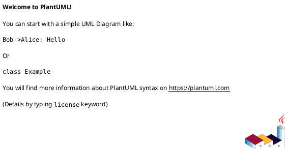

# Projet Fil Rouge : \<Votre Projet\>

> **Auteurs :**
>
>   * [Nom Prénom Etudiant 1]
>   * [Nom Prénom Etudiant 2]
>   * [Nom Prénom Etudiant 3]
>
> **Date :** [Date de rendu]

-----

## 📝 Description du Projet

Ce projet est une implémentation du célèbre jeu du **Morpion** (Tic-Tac-Toe) réalisée dans le cadre du module de Programmation Orientée Objet Avancée.

-----

## 🏗️ Architecture et Conception (POOA)

Cette section détaille les choix techniques qui justifient l'aspect "Avancé" de la programmation.

### 1\. Architecture Globale




### 2\. Design Patterns utilisés

Voici les patrons de conception mis en œuvre pour répondre aux exigences de flexibilité :


-----

## ✨ Fonctionnalités

  - [x] Grille de jeu standard (3x3).
  - [ ] Grille de taille variable (NxN).

-----

## 🚀 Installation et Lancement

Ce projet utilise **Gradle** pour la gestion des dépendances et la compilation.

### Prérequis

  * JDK 21 ou supérieur.
  * Git.

### Cloner le projet

### Lancer le Projet (Console / GUI)


### Lancer les tests unitaires


-----

## 📂 Structure du Projet

```
src
├── main
...
```

-----

## 🛠️ Difficultés Rencontrées et Améliorations


## Méthodologie et Outils Utilisés